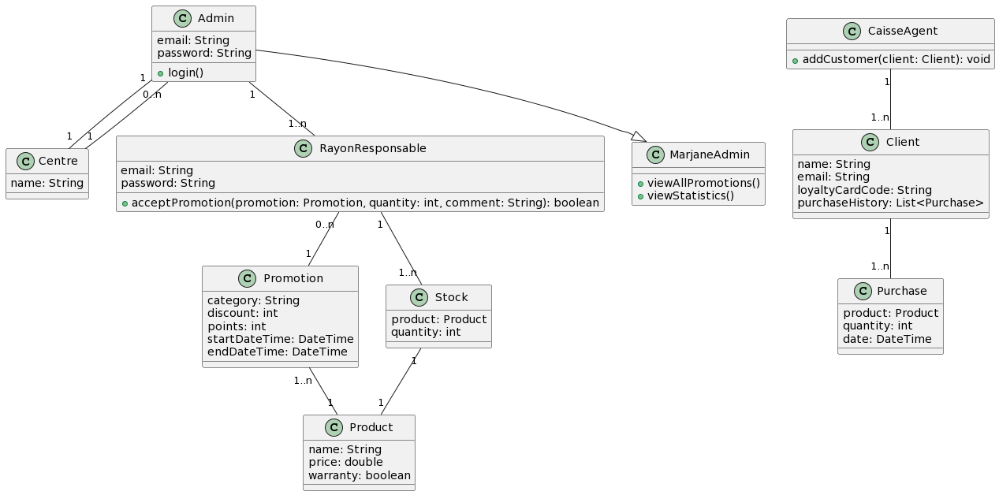
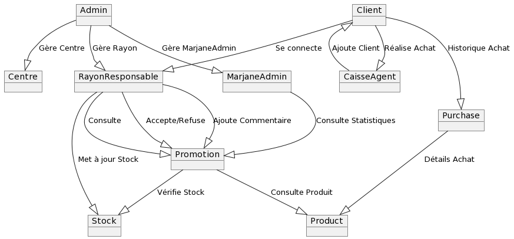
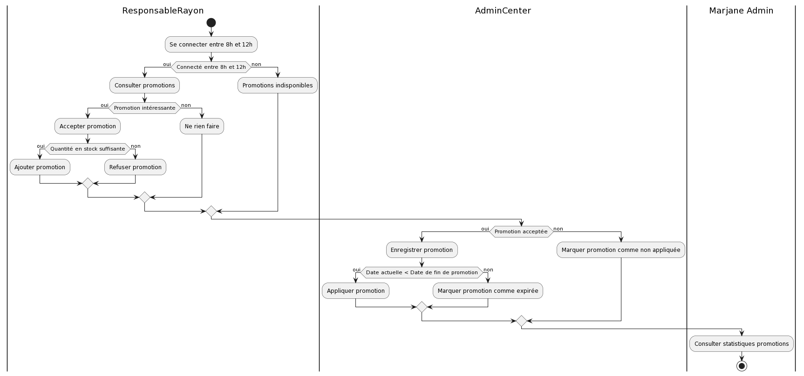

# Project Name

A brief description of your project.

## Table of Contents

- [Introduction](#introduction)
- [Class Diagram](#class-diagram)
- [Collaboration Diagram](#collaboration-diagram)
- [Activity Diagram](#activity-diagram)
- [Usage](#usage)
- [Contributing](#contributing)
- [License](#license)

## Introduction

Provide a concise introduction to your project. Explain its purpose, features, and any other relevant information.

## Class Diagram

Include a class diagram to visualize the structure of your classes and their relationships. You can use PlantUML or other tools to create the diagram and embed it as an image.

## Collaboration Diagram

Visualize how different components or classes collaborate in your system. This helps users understand the flow of information and interactions.

## Activity Diagram

Show the flow of activities or processes in your system using an activity diagram. This provides a high-level overview of how certain tasks or processes are accomplished.

